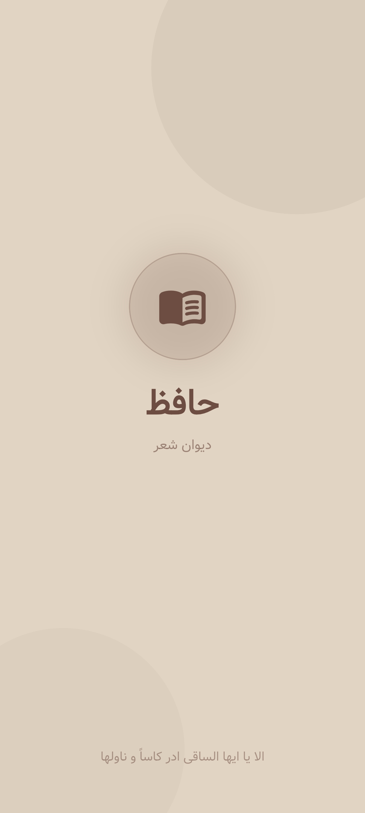
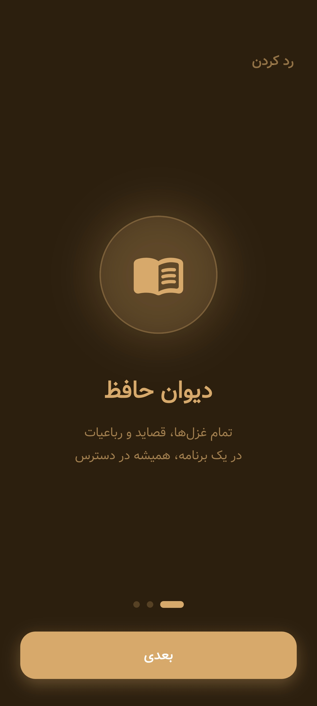
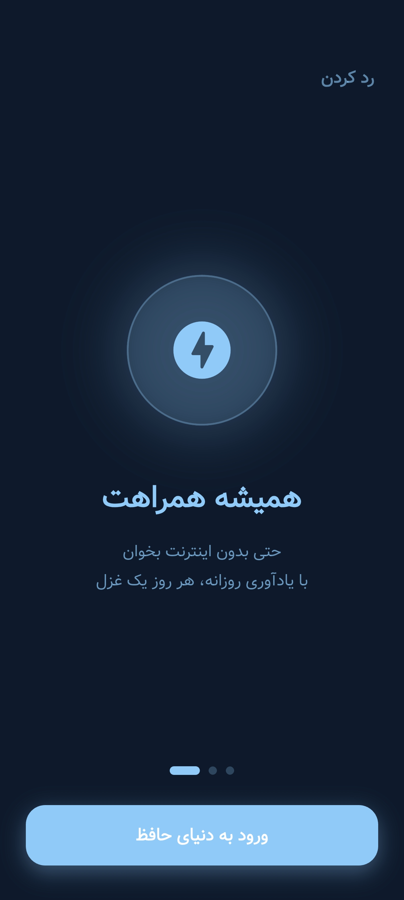
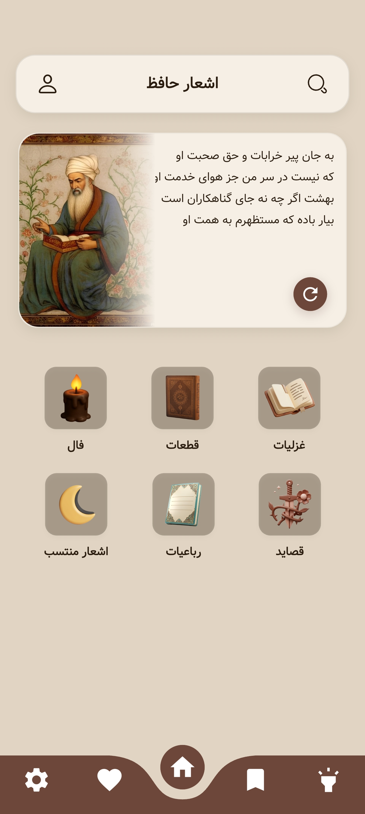
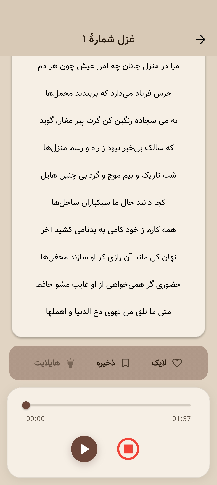

<div dir="rtl">

<div align="center">

#  اشعار حافظ

### اپلیکیشن موبایل برای مطالعه اشعار خواجه شمس‌الدین محمد حافظ شیرازی

<a href="https://github.com/Abolfazl-Dev-Code/hafez-poems/releases/latest">
  
</a>


</div>

---

<div align="center">

|                              |                              |                              |                              |                              |                              |
| :--------------------------: | :--------------------------: | :--------------------------: | :--------------------------: | :--------------------------: | :--------------------------: |
|  |  |  |  |  |  |

</div>

---

## ✨ ویژگی‌ها

- 📚 مجموعه کامل اشعار حافظ — غزلیات، رباعیات، قصاید، قطعات و اشعار منتسب
- 🎧 پخش صوتی تمام اشعار حافظ با روایت و همگام با مصرع از طریق گنجور
- 🎶 امکان انتخاب و تغییر خواننده اشعار
- 📩 امکان اشتراک گذاری شعر مورد نظر / کپی مصرع مورد نظر
- 🔍 جستجوی سریع در بین تمام اشعار
- ❤️ قابلیت ذخیره اشعار، افزودن به علاقه‌مندی‌ها و هایلایت مصرع مورد نظر
- 🎴 فال حافظ همراه با تفسیر و ذخیره سازی
- 🐦‍🔥 زندگینامه حافظ با روایتی زیبا
- 🌙 پشتیبانی از تم تاریک و روشن
- 🔔 یادآوری روزانه با زمان‌بندی دلخواه
- 📴 آنلاین و آفلاین — بدون نیاز به اینترنت

---

## 👇 این قسمت برای توسعه دهندگان عزیز در نظر گرفته شده است 👇

---

## 🛠 پیش‌نیازها

- [Flutter SDK](https://docs.flutter.dev/get-started/install) نسخه `3.x` یا بالاتر
- Dart SDK نسخه `3.11.0` یا بالاتر
- Android Studio یا VS Code

---

## 🚀 نحوه Build

**۱. Clone کردن پروژه**

```bash
git clone https://github.com/YOUR_USERNAME/hafez_poems.git
cd hafez_poems
```

**۲. اضافه کردن فونت‌ها**

پوشه‌ای به نام `fonts/` در ریشه پروژه بساز و فایل‌های زیر رو داخلش بذار:

```
fonts/
├── morvarid.ttf
└── vazir.ttf
```

> این فونت‌ها به‌دلیل محدودیت لایسنس در ریپو نیستن.
> می‌تونی از [Vazir](https://rastikerdar.github.io/vazir-font/) دانلود کنی.

**۳. نصب پکیج‌ها**

```bash
flutter pub get
```

**۴. اجرا**

```bash
flutter run
```

**۵. Build برای Android**

```bash
flutter build apk --release
```

---

## 🗂 ساختار پروژه

```
lib/
├── controllers/   # GetX controllers
├── models/        # Hive data models
├── screens/       # صفحات اصلی اپ
├── services/      # Cache، notification، API
├── theme/         # تم و رنگ‌بندی
└── widgets/       # کامپوننت‌های مشترک

assets/
├── icon/          # آیکون‌های اپ
└── json/          # دیتای اشعار (آفلاین)
```

---

## 🧰 تکنولوژی‌ها

| ابزار                       | کاربرد                    |
| --------------------------- | ------------------------- |
| Flutter                     | فریم‌ورک اصلی             |
| GetX                        | مدیریت state و navigation |
| Hive                        | ذخیره‌سازی local          |
| audioplayers                | پخش صوتی                  |
| shared_preferences          | تنظیمات کاربر             |
| flutter_local_notifications | سیستم یادآوری             |
| connectivity_plus           | تشخیص اتصال اینترنت       |
| skeletonizer                | لودینگ skeleton           |

---

## ⚠️ محدودیت‌های قانونی

© 2026 Abolfazl. تمامی حقوق محفوظ است.

کپی، توزیع یا استفاده تجاری از این کد بدون اجازه کتبی صاحب اثر ممنوع است.

</div>
